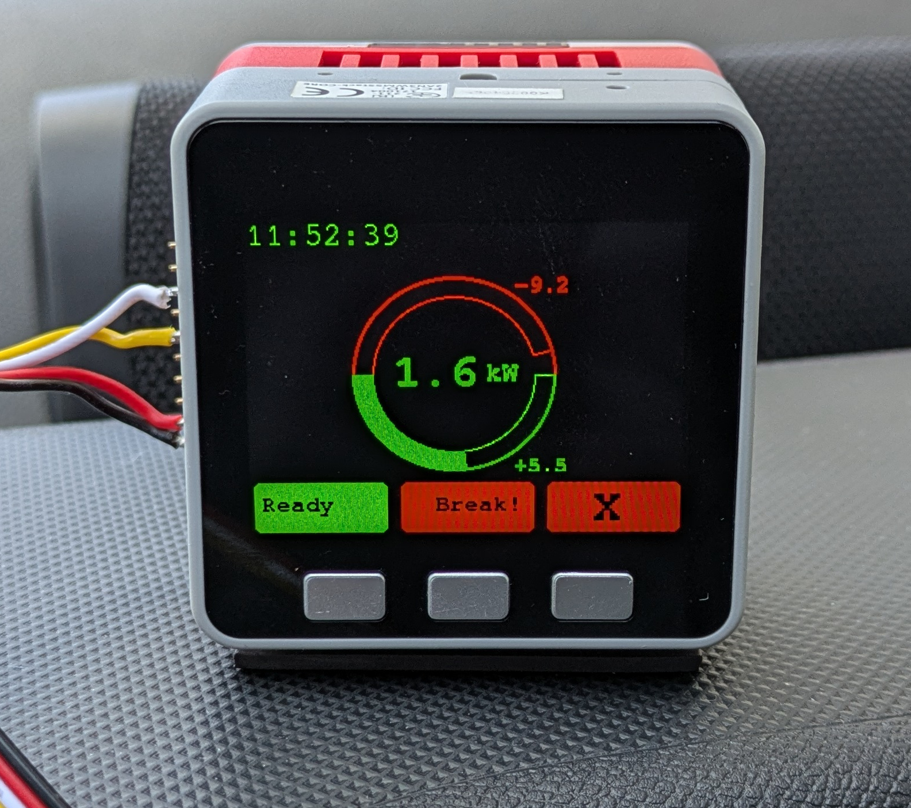

# Display and Logging for Citroen AMI / Opel Rocks-e

# ${\color{red}Warning!}$
${\color{red}Working\space with \space the \space CAN \space on \space your \space car \space can \space be \space very \space dangerous.}$
${\color{red}This \space is \space just \space for \space research \space purpose.}$
${\color{red}If \space you \space use \space this, \space you'll \space do \space it \space at \space your \space own \space risk.}$

## Introduction
The intetion is to display and gather more information from the Citroen AMI. Ist hat two CAN interfaces at the ODB2 plug. The standard one at pins 6 (CAN High)/ 14 (CAN Low) with signal groud at pin 5.

On this bus already some reasearch has been done. This project extends this by two means:
* Cleaning up the signal definitions
* Using this information to decode the data on a microcontroller and display it

I'm no professional programmer. So the code will not be very optimized and not very clean. If there is real interest I welcome other to help this project growing.

Picture of power fed into the battery during charging.

## Outlook
This actual state is very basic and just the work of a few hours. Since there is interest in this state, the project is published as it is now. There is no good definitions of pins etc. This all needs to be done. Actually its less than a prove of conceptC and heavily work in progress.

First intention is to get things running. In the second step it might be made "nicer".

A few things which are planned to be included:
* Publishing different data via MQTT:
    * directly via WIFI, if available
    * via bluetooth to a smartphone which acts as bridge to MQTT
* Logging of CAN raw data (maybe just reduced due to performace/space issues)
* Using data in the car. i.e. Use the gear information to trigger a reverse camera
* Deeper alaysis of the "performance" (maybe with erxternal programs which analyze log data)
    * Battery health
        * Inner resistance
        * Monitoring of capacity
    * Perfoemace reduction monitoring (i.e. with lower temperatures)
    * Cumulation of consumed and charged power (energy)
    * Monitoring of 12V battery. Some people reported it got drained.

## Setup
This project is a PlatformIO project in VSCode. "Just" clone or download this repository and open it in VSCode with PlatformIO plugin installed. This hopefully installs all needed libraries and frameworks.

There are three profiles defined in [platform.ini](platform.ini) which contain most configuration for the three devices
- Core
- Core2
- CoreS3.

Unfortunetely I can only test on Core and CoreS3.

### secrets.h
You have to create a secrets.h file in te src directory. An example is put in [secrets_example.h](./src/secrets_example.h). Here you have to put your wifi credentials. The secrets.h is in the gitignore not to accidentially upload it to github.

## Wiring and Hardware
Actually it is based on an m5Stack core (tested on m5Stack grey), which I had laying around. Since I'm using M5Unified, M5GFX and not using any of the additional hardware of the m5stack grey, it should work on other m5Stacks. Also no sleep mode is used so far. Unfortunately it is seems to be broken on eraly m5. Mine takes 10mA in sleep mode, which is way too high for longer use. It makes even no difference in deep sleep or light sleep.

### Addidiona hardware needed
#### RTC
Since there is no RTC in the m5 Core, I added a DS3231 wired to a second i2c bus. The second bus is needed, because there exists already i2c devices on the first bus having the same adress.

 Wiring:
* PIN17 -> SDA of RTC
* PIN16 -> SCL of RTC

There exists very small ones of these RTC modules, where you can solder the backup battery to the site, so it fits on an m5stack bus shield.

Newer m5 have an RTC included, but it is actually not used in this version of the software. Actually you may need to manually deactivate the clock stuff or rewitre it (plans for future).

#### Can module
I'm using [Unit CAN](https://docs.m5stack.com/en/unit/can) for CAN communication. I tested the COMMU module, but I could not get the MCP2515 working. Several other reported problems with that module too. The Unit CAN worked immediatley and so far reliable. And ***"The built-in DC-DC isolated power chip can isolate noise and interference and prevent damage to sensitive circuits."*** So it seems to be a good choice.

The module is connected via UART:
* RX of module -> PIN35 of m5
* TX of module -> PIN25 of m5

The wiring of the can side is straightforward:
* H -> CAN High at ODB2 (pin 6)
* L -> CAN Low at  ODB2 (pin 14)
* G -> Signal Ground at ODB" (pin 5).

## CAN data
In CAN_information [CAN_information](./CAN_information/) you'll find the actual dbc/sym files which help decoding the can frames.
